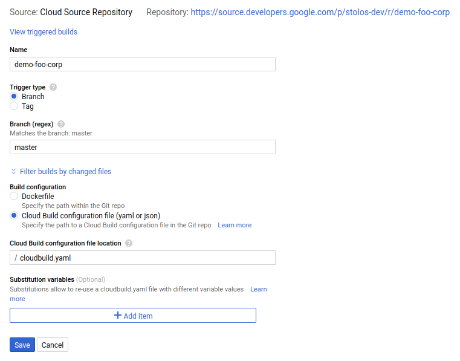

# How to Guide: Validate Configs in CI/CD

In addition to running `nomos vet` as a [pre-commit hook][0] locally, we
recommend validating any configuration changes in your CI/CD pipeline. This
guide shows how to validate configuration changes with [Cloud Build][1] when
using GKE clusters. The same setup works in any container-based CI/CD system
(e.g. CircleCI) with minimal changes.

1.  Enable Cloud Build API:
    https://console.cloud.google.com/flows/enableapi?apiid=cloudbuild.googleapis.com

2.  Grant Cloud Build service account permission to access your GKE cluster.
    Follow the [instructions here][2] and give the service account the
    `Kubernetes Engine Developer` role.

3.  Create a [Cloud Build config][3] file and store it in the same repo as your
    config files (e.g. my-repo/cloudbuild.yaml):

    ```yaml
    steps:
    - name: 'gcr.io/cloud-builders/kubectl'
    args: ['config', 'current-context']
    volumes:
    - name: 'kube'
    path: '/kube'
    env:
    - 'KUBECONFIG=/kube/config'
    - 'CLOUDSDK_COMPUTE_ZONE=us-central1-a'
    - 'CLOUDSDK_CONTAINER_CLUSTER=my-cluster'
    - 'CLOUDSDK_CONTAINER_USE_APPLICATION_DEFAULT_CREDENTIALS=true'
    - name: 'gcr.io/nomos-release/nomos:stable'
    args: ['nomos', 'vet', '--path', '/workspace']
    volumes:
    - name: 'kube'
    path: '/kube'
    env:
    - 'KUBECONFIG=/kube/config'
    timeout: 30s
    ```

    There are two steps in this configuration:

    1.  Run `kubectl config current-context` to generate the
        [kubeconfig file][4] needed to authenticate to the `my-cluster` GKE
        cluster
    2.  Run `nomos vet` on the Git repo which is automatically cloned in
        `/workspace`.

4.  Set up a build trigger for changes to your source repository
    [following the instructions here][5]. You can create triggers for GitHub\*,
    Bitbucket, and Cloud Source Repository. The following example creates a
    trigger that runs for every commit to the master branch of a Cloud Source
    Repo. Use the Cloud Build configuration file from the previous step:

    

5.  Test the setup by manually running the trigger:
    https://console.cloud.google.com/cloud-build/triggers If things are set up
    correctly, the Cloud build steps should be green.

And you’re done!

\* For GitHub users, Cloud Build is also [available in the marketplace][6].

[0]: https://cloud.google.com/anthos-config-management/docs/nomos-command#vet
[1]: https://cloud.google.com/cloud-build/
[2]: https://cloud.google.com/cloud-build/docs/securing-builds/set-service-account-permissions
[3]: https://cloud.google.com/cloud-build/docs/build-config
[4]: https://kubernetes.io/docs/concepts/configuration/organize-cluster-access-kubeconfig/
[5]: https://cloud.google.com/cloud-build/docs/running-builds/automate-builds
[6]: https://github.com/marketplace/google-cloud-build
